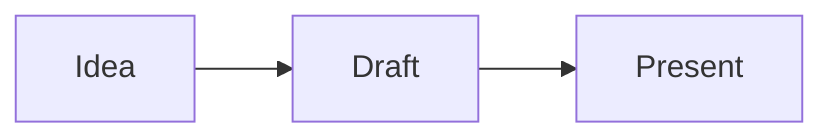

<!-- deck
title: Untitled deck
theme: paper
ratio: 16:9
footer: Draft deck
-->

<!-- slide template=title -->
# Untitled deck
## A portable editable presentation
Your name · 2026

<!-- slide -->
## Main idea

- Say one thing clearly
- Keep each slide light
- Use the editor to add, duplicate, move, or delete slides

<!-- slide 2col 3/2 -->
## Two-column slide

<!-- @left -->
- Put explanation here
- Keep bullets short

<!-- @right -->

<!-- @notes -->
Speaker notes are visible in speaker view, not on the slide.

<!-- slide template=closing -->
# Thank you
Questions?

